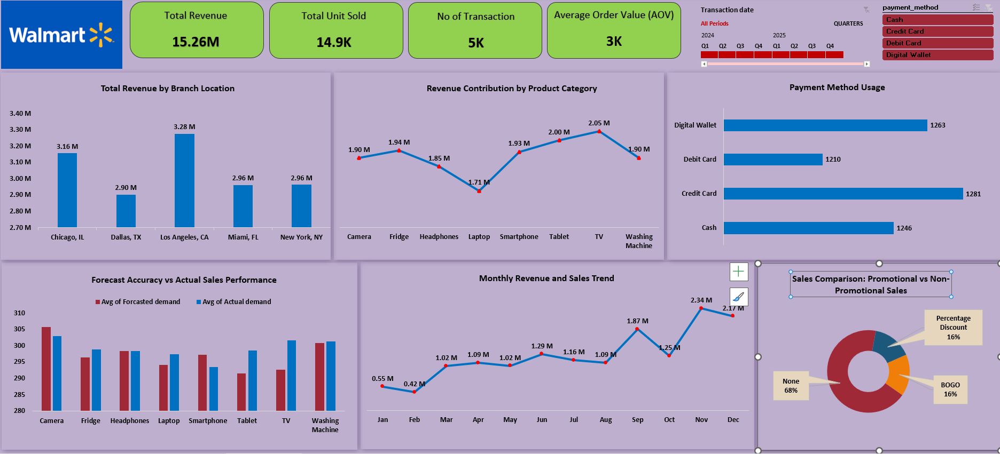

# Walmart Sales Dashboard 📊

## 📌 Project Overview
This project is an **interactive Walmart sales dashboard** created entirely in **Microsoft Excel**.  
It analyzes Walmart’s sales data to provide insights into revenue trends, branch performance, product category contributions, payment methods, promotional sales impact, and forecast accuracy.

---

## 📷 Dashboard Preview

---

## 📂 Dataset Information
The dataset (`Walmart_Sales_Data_Filtered_Project.xlsx`) contains:
- Transaction Date  
- Branch Location  
- Product Category  
- Units Sold  
- Revenue  
- Payment Method  
- Promotion Type  
- Forecasted Demand vs Actual Demand  

Data cleaning, preparation, and visualization were **all done in Excel** using pivot tables, charts, slicers, and conditional formatting.

---

## 🎯 Key Insights
- **Total Revenue:** 15.26M  
- **Total Units Sold:** 14.9K  
- **Number of Transactions:** 5K  
- **Average Order Value (AOV):** 3K  
- Top branch by revenue: **Los Angeles, CA** (3.28M)  
- Top category: **TV** (2.05M revenue)  
- Most used payment method: **Digital Wallet**  
- Promotions contributed **32%** to total sales.  

---

## 🛠 Tools & Techniques Used
- **Microsoft Excel**
  - Pivot Tables & Pivot Charts  
  - Slicers for interactivity  
  - Conditional Formatting for KPIs  
  - Data Cleaning & Preparation  

---

## 📈 Skills Demonstrated
- Data Cleaning & Transformation in Excel  
- Dashboard Design & Layout  
- Interactive Data Visualization  
- Sales Trend Analysis

